<p align="center">
  
</p>

<h1 align="center">BOAR</h1>

<p align="center">
  <b>AI that works when the internet doesn't.</b><br />
  An open-source research assistant that runs entirely on your phone, and shows where every answer came from.
</p>

<p align="center">
  <a href="https://github.com/rferrari/boar-app/releases/latest"></a>
  
  
  <a href="./LICENSE"></a>
</p>

<p align="center">
  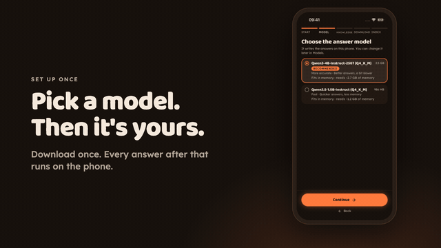
</p>

<p align="center">
  <a href="#get-it">Get it</a> ·
  <a href="#how-it-answers">How it answers</a> ·
  <a href="#measured-on-a-real-phone">Benchmarks</a> ·
  <a href="#bounty-requirements">Requirements</a> ·
  <a href="#docs">Docs</a> ·
  <a href="./MANIFESTO.md">Manifesto</a>
</p>

## Why

Search and chat assistants stop working the moment you lose signal: on a plane, a
trail, a border crossing, a blackout. BOAR downloads a small language model and
the knowledge you pick **once**, then answers in airplane mode, with no account,
no server and no Google Play Services.

It started from Vitalik's call for an offline research tool that is "more than
half as good" as search plus a frontier model, running an extreme mixture of
experts that mostly sits on disk. That model doesn't exist yet, so BOAR is two
things: a useful offline companion today, and a workbench that measures how close
a phone can get. Full reasoning: [MANIFESTO.md](MANIFESTO.md).

<table>
<tr>
<td width="33%">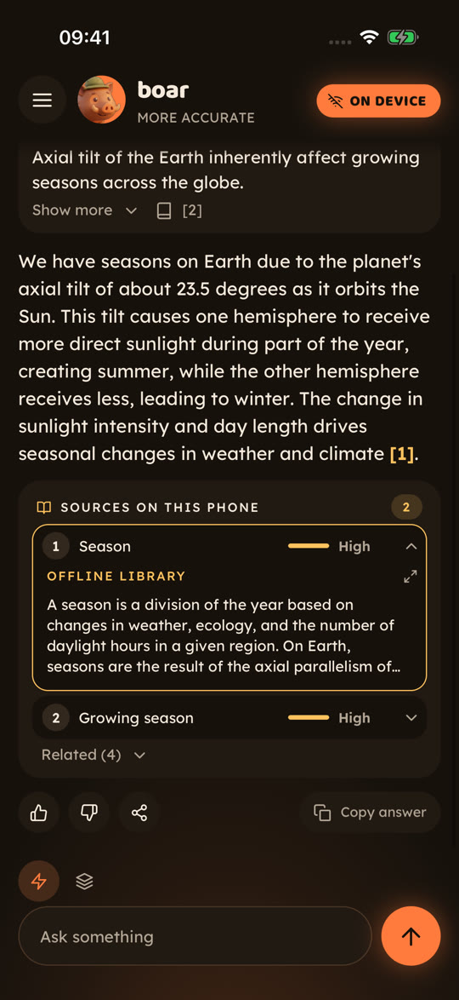</td>
<td width="33%">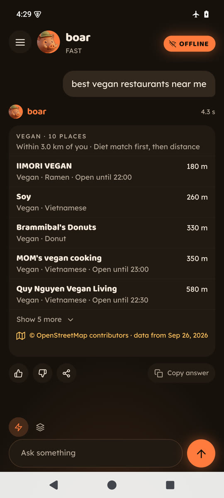</td>
<td width="33%">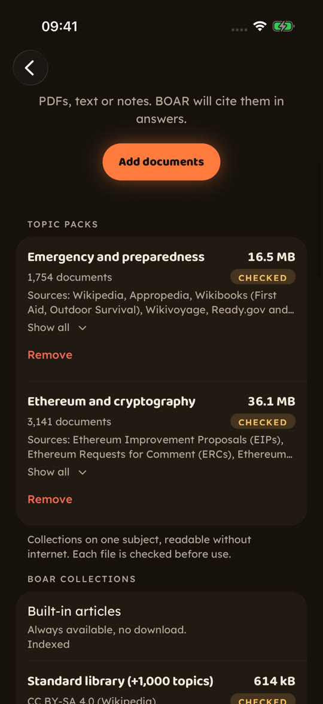</td>
</tr>
<tr>
<td><b>Answers with sources.</b> Tap a citation to read the exact passage.</td>
<td><b>Places near you.</b> Distance and opening hours from OpenStreetMap, in airplane mode.</td>
<td><b>Knowledge you choose.</b> Topic packs, Wikipedia, or your own files.</td>
</tr>
</table>

**One engine, two apps.** Search, packs, models, measurements and sharing are one shared engine. Each platform gets its own app on top: on **iPhone**, the animated app in these screenshots (`src/ui-ios`); on **Android**, a lighter app built for mid-range phones, in the Campfire and Moonlight themes (`src/ui-android`). Each build picks its app by platform (`App.ios.tsx`, `App.android.tsx`).

## Online once, offline from then on

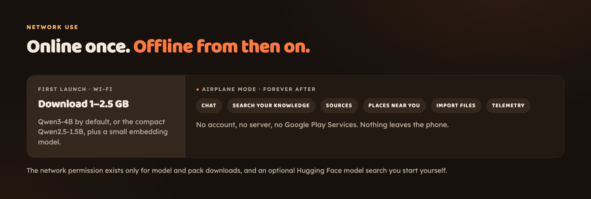

First launch downloads an answer model plus a small embedding model: Qwen3-4B
(about 2.5 GB) by default, or the compact Qwen2.5-1.5B (about 1 GB) for phones
with less RAM. That is the only network use the app needs. The network
permission stays for two things you start yourself: downloading more models or
packs, and searching Hugging Face for other GGUF models. Why the permission is
present but unused during chat: [ARCHITECTURE.md](ARCHITECTURE.md).

## How it answers

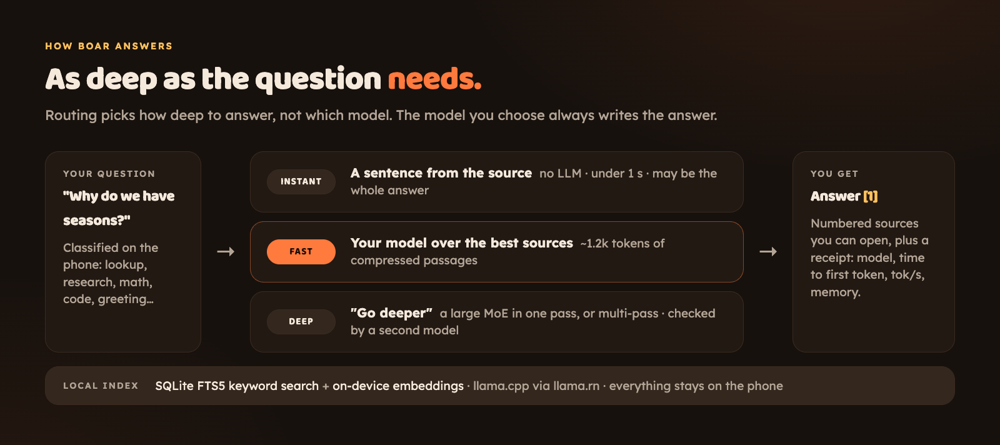

Routing picks **how deep** to answer, never which model writes a normal answer:
an **instant** source sentence (no LLM, under 1 s), a **fast** answer from your
model over compressed sources, or a **deep** answer from a large MoE or several
passes ("Go deeper"), checked by a second model. Retrieval is local and hybrid: SQLite FTS5
keyword search plus on-device embeddings. Inference is `llama.cpp` via `llama.rn`.
Every answer records the model, load time, time to first token, tokens/sec,
memory and what it retrieved. Details: [docs/ADAPTIVE_ROUTING.md](docs/ADAPTIVE_ROUTING.md).

## What it can cite

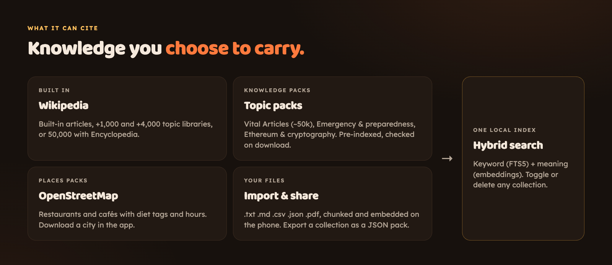

- **Built in:** Wikipedia articles, plus the Standard (+1,000 topics) and Full (+4,000) libraries. The Encyclopedia setup adds 50,000 Wikipedia Vital Articles.
- **Knowledge packs:** pre-indexed files such as Wikipedia Vital Articles, Emergency & preparedness, Ethereum & cryptography ([KNOWLEDGE_PACKS](docs/KNOWLEDGE_PACKS.md)).
- **Places packs (iPhone app for now):** OpenStreetMap restaurants and cafés with diet tags and hours, plus Wikivoyage listings. Download a city in setup or in Knowledge (Berlin is 3.3 MB for 15,278 places) ([POI_PACKS](docs/POI_PACKS.md)).
- **Your files:** `.txt`, `.md`, `.csv`, `.json`, `.pdf` (selectable text, no OCR), chunked and embedded on the phone. Toggle, delete, or export a collection as a JSON pack to share over Bluetooth or Nearby Share ([USING](docs/USING.md)).

## Measured on a real phone

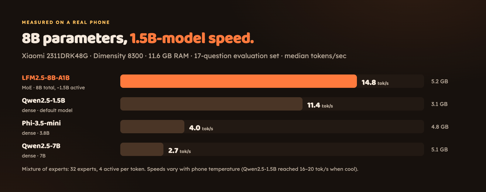

| Model | Architecture | Median tok/s | Peak memory |
|---|---|---|---|
| **LFM2.5-8B-A1B** | MoE, 8B total, ~1.5B active | **14.8** | 5.2 GB |
| Qwen2.5-1.5B (compact) | dense, 1.5B | 11.4 | 3.1 GB |
| Phi-3.5-mini | dense, 3.8B | 4.0 | 4.8 GB |
| Qwen2.5-7B | dense, 7B | 2.7 | 5.1 GB |

Xiaomi 2311DRK48G, Dimensity 8300, 11.6 GB RAM, 17-question evaluation set, on a hot phone (24 Sep 2026).

Later runs, with the phone kept cool and the model kept loaded: Qwen2.5-1.5B at **16.8 tok/s** on the same X6 Pro (1 Oct) and **19.6 tok/s** on a POCO F3 (Snapdragon 870, 8 GB; 29 Sep). On the X6 Pro the first word comes after 1.6 s when no sources are needed and 6.8 s with four full passages, which is why fast answers now send only the sentences that answer.

- The MoE model is as fast as the 1.5B dense model while carrying 8B parameters, and it was the only one to get the multi-step RAM-budget question right.
- Its weak spot: it reasons before answering, and with a 512-token budget 4 of 17 answers ran out before the final answer.
- Not every MoE loads yet: Instella-MoE-16B-A3B fails on this llama.cpp build, and the evaluation records that instead of skipping it.

Repeat or extend the runs on your own phone with one command:
[docs/DEVICE_EVALUATION.md](docs/DEVICE_EVALUATION.md). Raw files:
[docs/evidence](docs/evidence/).

## Bounty requirements

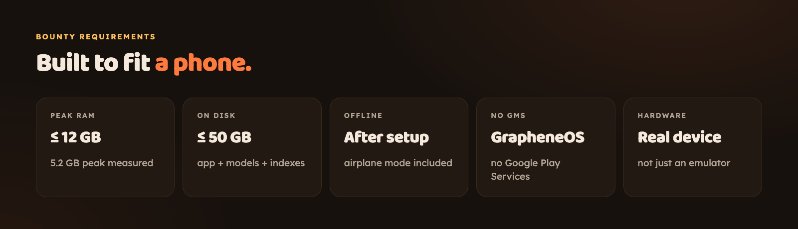

Built for the [poidh bounty #31](https://poidh.xyz/mainnet/bounty/31), "Best Offline
AI Research App". Status of each requirement, with the benchmark files:
[docs/COMPLIANCE.md](docs/COMPLIANCE.md). Submission wallet:
`0x32d1C8A4d133241a710d780f1198992A015Ea5Ed`.

## Get it

<table>
<tr>
<td width="25%">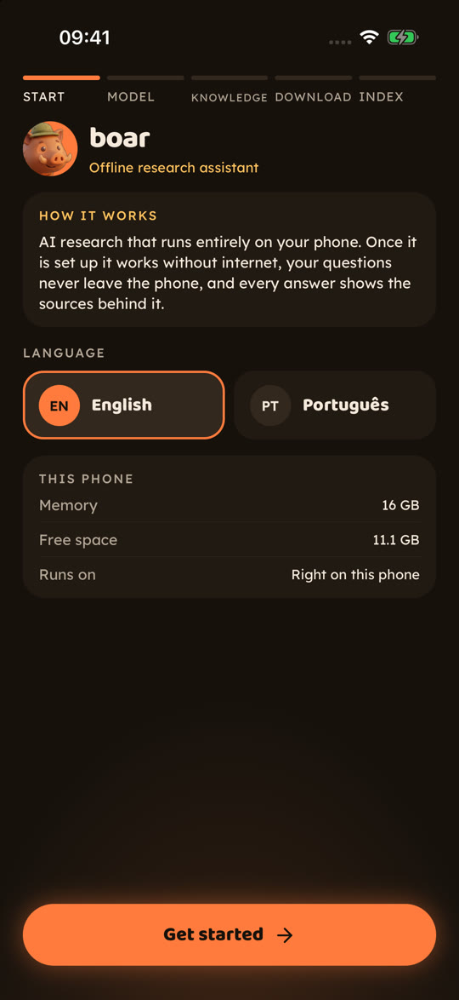</td>
<td width="25%">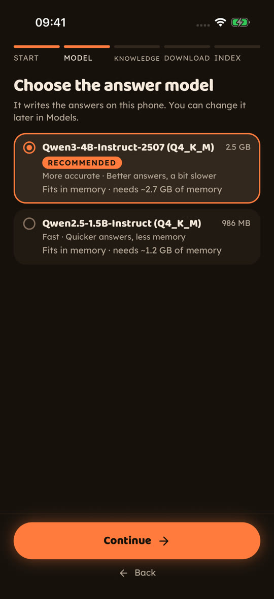</td>
<td width="25%">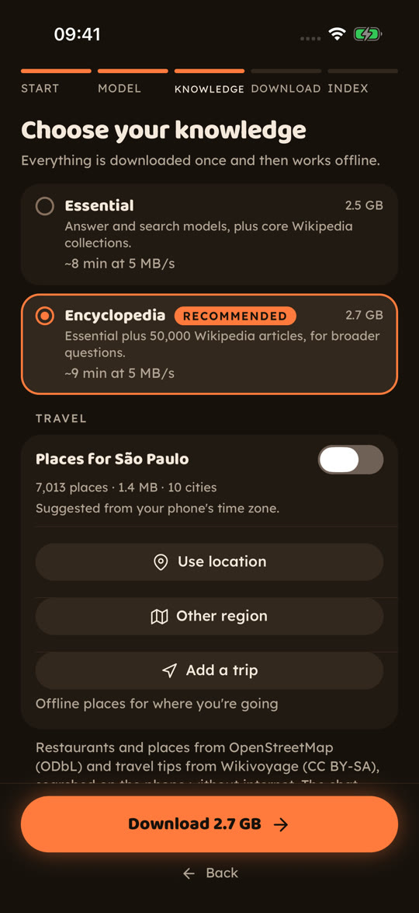</td>
<td width="25%">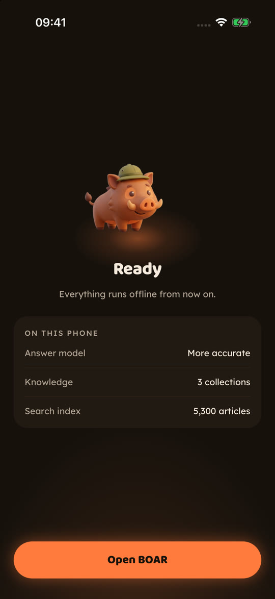</td>
</tr>
<tr>
<td><b>Start.</b> English or Portuguese, and what this phone has.</td>
<td><b>Pick a model.</b> Qwen3-4B, or the lighter Qwen2.5-1.5B.</td>
<td><b>Pick knowledge.</b> Essential or Encyclopedia, plus your city's places.</td>
<td><b>Ready.</b> Download and index once, then offline.</td>
</tr>
</table>

**Android APK:** download `boar-v1.0.0-arm64.apk` from the
[latest release](https://github.com/rferrari/boar-app/releases/latest) (122 MB, any
64-bit ARM phone), check it and install it:

```bash
sha256sum -c boar-v1.0.0-arm64.apk.sha256   # prints "boar-v1.0.0-arm64.apk: OK"
adb install boar-v1.0.0-arm64.apk           # or open the file on the phone
```

The v1.0.0 APK (Sep 26) downloads Qwen2.5-1.5B (about 1 GB) on first launch.
Builds from `main` default to Qwen3-4B (about 2.5 GB) and have the new look: the animated app on iPhone, the lighter one on Android.

**Guided setup:** the wizard downloads and installs the APK over USB, builds from
source (cloud via EAS, no Android SDK needed, or local), starts a live-reload dev
build, or builds a bigger knowledge pack.

```bash
git clone https://github.com/rferrari/boar-app.git && cd boar-app
make setup    # or: node scripts/setup.mjs · `make help` lists the single steps
```

**iOS:** builds from the same code. To put it on your own iPhone with a free Apple ID, see [docs/IOS_FREE_INSTALL.md](docs/IOS_FREE_INSTALL.md); build details in [docs/IOS.md](docs/IOS.md).

## Docs

| | |
|---|---|
| [docs/demo](docs/demo/README.md) | Videos and screenshots from a phone in airplane mode |
| [docs/USING.md](docs/USING.md) | Import documents, find more models, recover from a bad model load, reset the app |
| [docs/DEVELOPMENT.md](docs/DEVELOPMENT.md) | Build commands, dev mode, Wi‑Fi troubleshooting |
| [docs/IOS_FREE_INSTALL.md](docs/IOS_FREE_INSTALL.md) | Install on your own iPhone with a free Apple ID |
| [docs/IOS.md](docs/IOS.md) | iOS build, native modules, Android/iOS parity |
| [ARCHITECTURE.md](ARCHITECTURE.md) | Design, first-run setup, network permission |
| [docs/MODELS.md](docs/MODELS.md) | Exact models, datasets and indexes |
| [docs/KNOWLEDGE_PACKS.md](docs/KNOWLEDGE_PACKS.md) | How knowledge packs are built and searched |
| [docs/EVAL_QUERIES.md](docs/EVAL_QUERIES.md) | The evaluation questions, including the set on Vitalik's topics |
| [docs/RESULTS_SCORE.md](docs/RESULTS_SCORE.md) | How shared runs are signed and scored |
| [docs/RELEASING.md](docs/RELEASING.md) | Building and publishing a signed release |
| [PRIVACY.md](PRIVACY.md) · [TERMS.md](TERMS.md) | Privacy policy and terms (preview) |

License: [LICENSE](LICENSE).
